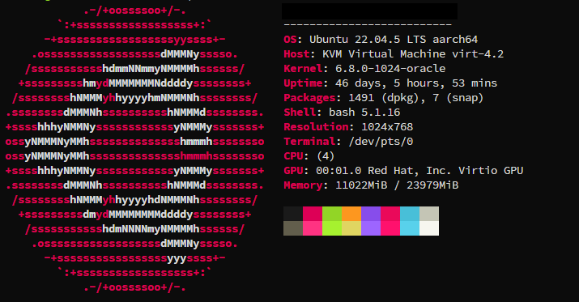
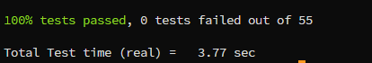

# CS2 Server on ARM with Box64

In this guide I will be explaining what I did to make a simple CS2 server run on ARM.<br>
You can potentially follow these steps to make any kind of servers, but you will be on your own since I'm not an *indian tech support guy* 😶 (love to all my fellow L1 ❤)<br>
If you expect me to write a serious guide, you are wrong.<br>
Don't care what you think, never will 😁.

## Table of contents
- [CS2 Server on ARM with Box64](#cs2-server-on-arm-with-box64)
  * [Table of content](#table-of-contents)
  * [Tested on](#tested-on)
  * [Basic info and shit you need](#basic-info-and-shit-you-need)
  * [User setup](#user-setup)
  * [Box64 is very cool](#box64-is-very-cool)
  * [Entering steamcmd territory now, shit about to go crazy](#entering-steamcmd-territory-now-shit-about-to-go-crazy)
  * [This is where the easy part ends...](#this-is-where-the-easy-part-ends)
    + [Optional](#--optional--)
  * [Networking](#networking)
  * [Known issues](#known-issues)

## Tested on
So far I have tested this on:
- Oracle cloud ARM machine *free tier* (I'm broke)
- Raspberry Pi 5

## Basic info and shit you need
- Linux machine from [Oracle Cloud](https://www.oracle.com/it/cloud/sign-in.html?intcmp=OcomFreeTier) *free tier* 
- OS is Ubuntu 22.04.5 since I'm a **basic bitch** 
- Self compiled version of [box64 on GitHub](https://github.com/ptitSeb/box64) 
- A [mouse](https://github.com/zThundy/CS2-Server-on-ARM/tree/main/images/mouse.png)
- A [keyboard](https://github.com/zThundy/CS2-Server-on-ARM/tree/main/images/keyboard.png)
- A brain and knowledge of Linux

## User setup
Since I'm not a mad man, I started by creating a new user that can only be accessed by localhost to have all this gargabe installed on it, and then changed the password to login into it.
```bash
sudo useradd -m steam
sudo passwd steam
```
I also decided to add the `steam` user account to the sudo enabled users with
```bash
sudo adduser steam sudo
```
afetr adding the user to the sudo group, I **su'd into this bitch**
```bash
sudo -u steam -s
```

## Box64 is very cool
After setting up the user, I proceeded to download box64 in the home directory.
I followed the [official guide](https://github.com/ptitSeb/box64/blob/main/docs/COMPILE.md).<br>
I will be typing all the commands I executed anyway. Do whatever you want.<br>
**Keep an eye on the official guide, since there are some examples for `Raspberry Pi`**
```bash
cd
git clone https://github.com/ptitSeb/box64.git
cd box64/
```
and compiled it with this magic
```bash
mkdir build; cd build; cmake .. -D ARM_DYNAREC=ON -D CMAKE_BUILD_TYPE=RelWithDebInfo -D BOX32=ON -D BOX32_BINFMT=ON
make -j4
sudo make install
```
I decided that I wanted to add BOX32 to the compiled box64 since I didn't know if the standard compile would work with CS2. I was throwing shit at the wall to see what was sticking. (it worked in the end so 🤷‍♂️)<br>
Since it was my first time installing box64, I executed
```bash
sudo systemctl restart systemd-binfmt
```
After the build, the amazing team at box64 added a command to test if the installation was working fine, so I used it, cause why not.
```bash
ctest
```
<br>
If tests passes then you are good to go 😄

## Entering steamcmd territory now, shit about to go crazy
So, VALVE is pretty bad at writing docs, always has been, but following the [guide on how to install steamcmd](https://developer.valvesoftware.com/wiki/SteamCMD#Manually), gave me a bit of an help.<br>
### ***DO NOT INSTALL USING APT*** shit wont work. Follow the manual installation.
I created a new folder
```bash
mkdir steamclient
cd steamclient
```
and downloaded and extracted the tar in this folder with
```bash
wget https://steamcdn-a.akamaihd.net/client/installer/steamcmd_linux.tar.gz
tar -xvzf steamcmd_linux.tar.gz 
```
after downloading the steamcmd client, I opened it using ./steamcmd.sh
Since box64 was already installed on the machine, it was detected and was being used automatically.

After it finished downloading, I exited it with `quit` and created a new folder in the home with
```bash
mkdir ~/cs2
```
where I then installed the server following [this guide](https://developer.valvesoftware.com/wiki/Counter-Strike_2/Dedicated_Servers) (partially).<br>
After creating the folder I run steamcmd again and executed these commands:
```bash
force_install_dir /home/steam/cs2
login anonymous
app_update 730 validate
```
Since it uses box64, this download and validation will take **AGES**, but hey... what can you do.

## This is where the easy part ends...
So, apparently when steam was installed, it was supposed to create a folder `.steam` in the /home/steam directory; **IT FUCKING DIDN'T**<br>
*Before doing this step, please check if the folder exist and if there is steamclient.so inside*
I executed
```bash
mkdir .steam
mkdir .steam/sdk64
cd .steam/sdk64
cp ~/steamclient/linux64/steamclient.so ./steamclient.so
```
adding the client to the home folder.

**Note: sometimes cs2 installation just fucks up and the server won't start anymore. If you encounter this, just validate the installation using `app_update` in steamcli.**

Now... steamclient is installed, cs2 server is downloaded, we can launch it.
in the folder `/home/steam` execute
```bash
touch start_cs2.sh
echo "BOX64_DYNAREC_LOG=0 BOX64_SSE42=1 BOX64_LOG=0 BOX64_ADDLIBS=/home/steam/cs2/game/bin/linuxsteamrt64/libv8_libcpp.so:/home/steam/steamclient/linux64/steamclient.so /home/steam/cs2/game/bin/linuxsteamrt64/cs2 -dedicated -port 27015 +exec autoexec.cfg" > start_cs2.sh
```
this will create a simple start script for your server with the missing libraries that won't make the server start.<br>

### **Optional**
Since I didn't want to execute commands and I created the server to practice on a practice map (I wanted a server so I could have the real shitty cs2 experience with ping lag) I also added an `autoexec.cfg` file in the path `/home/steam/cs2/game/csgo/cfg` with this stuff inside:
```cfg
sv_setsteamaccount <REDACTED>
hostname "<REDACTED>"
map de_dust2
host_workshop_map 3442607572
sv_password "<REDACTED>"
mp_humanteam any
mp_ignore_round_win_conditions 0
mp_round_restart_delay 0
# host_workshop_map 3072369998
mp_afterroundmoney 16000
mp_maxmoney 16000
mp_startmoney 16000
mp_freezetime 0
mp_restartgame 1
mp_warmuptime 5
sv_cheats 1
sv_infinite_ammo 1
```
I don't know if you want to change stuff, bit this is a very simple config.<br>
To populate `sv_steamaccount`:
- You must go to [this url](https://steamcommunity.com/dev/managegameservers) and create a new key to your name so that the server can authenticate with VALVE.<br>
- In `AppID` put `730` and in the `Name` put whatever you want.<br>

**DO NOT SHARE THIS STRING WITH ANYONE**

After this, you should be good to go.

## Networking
Just open the port 27015 so that people can connect to the server 😬

Anyway for networking I just added the rules to Oracle Cloud and ufw by doing
```bash
sudo ufw allow 27015
```
After that you can check if iptables has the rules added by executing
```bash
sudo iptables --list-rules | grep 27015
```
The result should look something like this
```bash
....
-A ufw-user-input -p tcp -m tcp --dport 27015 -j ACCEPT
-A ufw-user-input -p udp -m udp --dport 27015 -j ACCEPT
....
```

If you have any issues, please do not hesitate to open an [issue](https://github.com/zThundy/CS2-Server-on-ARM/issues). I will try to answer questions, but, as I said at the beginning, I'm not tech support 😁

## Known issues
- Plugins just don't work for me. If you manage to let em work, good for you 😊 (for real tho, if you do make them work, post your findings somewere so that I can add them to this repo)
- Metamod and CounterStrikeSharp give a Segfault, as described [here](https://github.com/ptitSeb/box64/issues/2753)